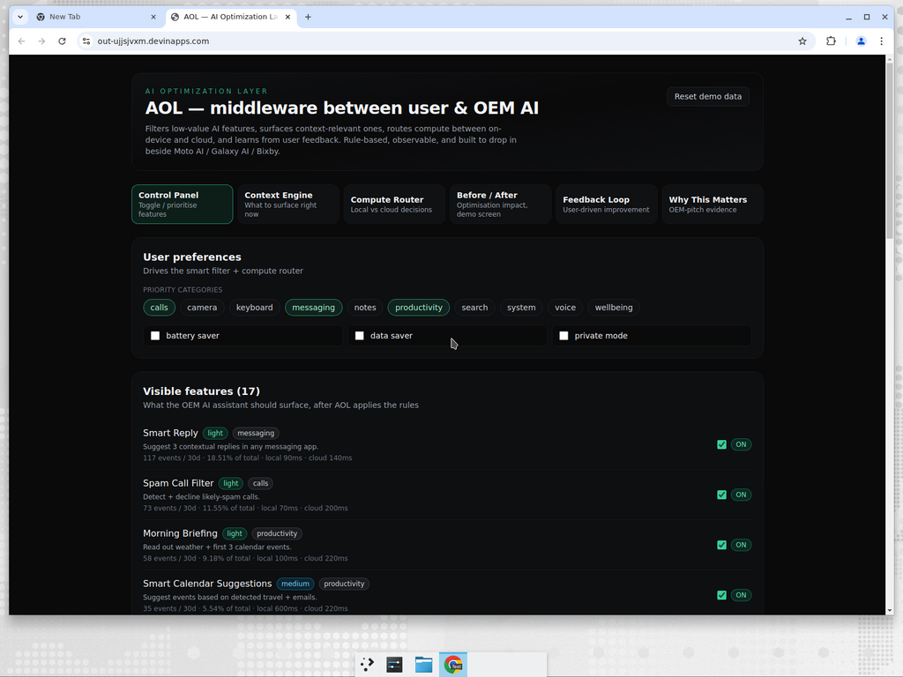
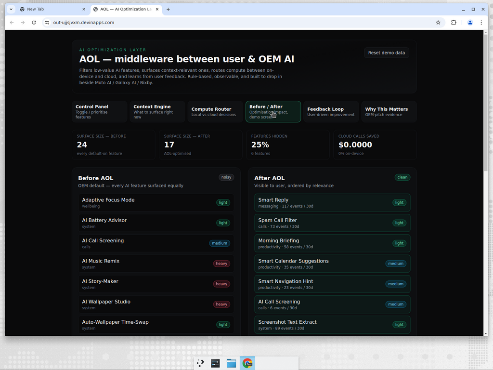
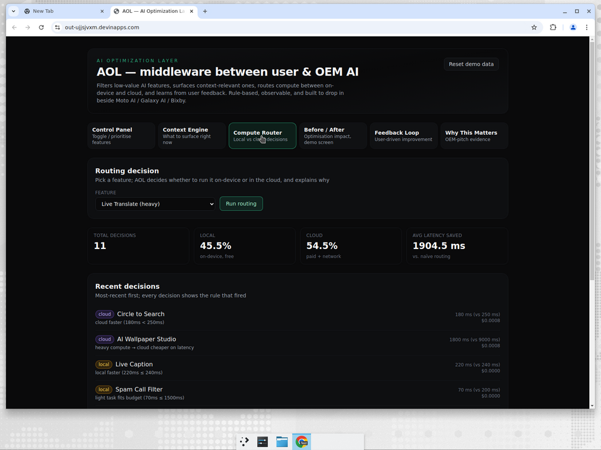
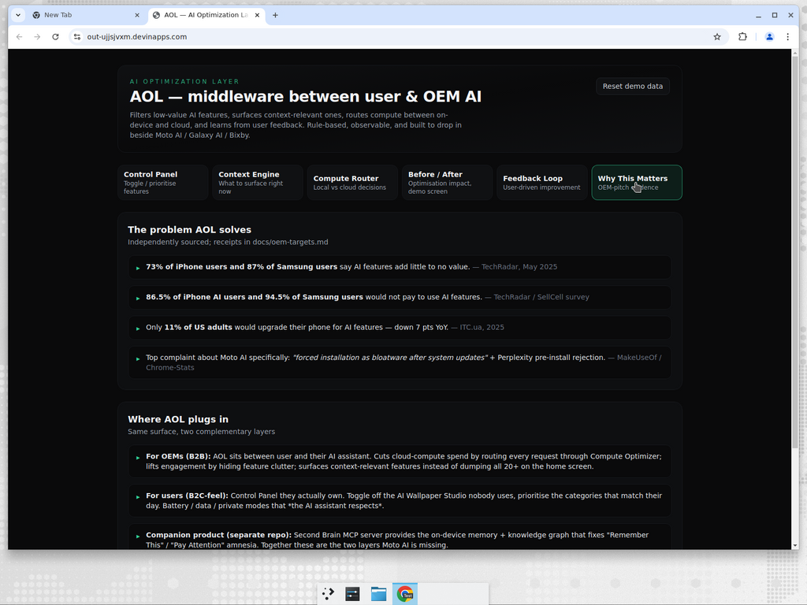

# AOL — AI Optimization Layer

**Middleware between the user and the OEM AI assistant.** Filters low-value
AI features, surfaces context-relevant ones, routes compute between local
and cloud, and ships a Control Panel users actually own. Built to drop in
beside Moto AI / Galaxy AI / OxygenOS AI / Nothing AI without competing with
their feature roadmap.

| | |
|---|---|
| Live demo | https://out-gwumfbso.devinapps.com |
| Live API + Swagger | https://aol-api-enqcpqaq.fly.dev/docs |
| Pitch deck | [`../../docs/oem-pitch/pitch-deck.md`](../../docs/oem-pitch/pitch-deck.md) |
| One-pager | [`../../docs/oem-pitch/one-pager.md`](../../docs/oem-pitch/one-pager.md) |
| OEM targets (ranked) | [`../../docs/oem-pitch/oem-targets.md`](../../docs/oem-pitch/oem-targets.md) |
| Outreach playbook | [`../../docs/oem-pitch/oem-outreach.md`](../../docs/oem-pitch/oem-outreach.md) |
| User-pain audit (Reddit / Twitter / Insta / FB) | [`../../docs/oem-pitch/user-pain-audit.md`](../../docs/oem-pitch/user-pain-audit.md) |
| What users want (the inverse — for Moto PMs) | [`../../docs/oem-pitch/what-users-want.md`](../../docs/oem-pitch/what-users-want.md) |
| Solo-founder 90-day campaign plan | [`../../docs/oem-pitch/solo-founder-to-moto.md`](../../docs/oem-pitch/solo-founder-to-moto.md) |
| Native integration (AIDL + Kotlin) | [`../../docs/oem-pitch/integration/`](../../docs/oem-pitch/integration/) |
| Companion product (memory layer) | this same repo — see top-level [`README`](../../README.md) and PR #3 |

## Why this exists

Every OEM is paying for cloud AI compute that users don't use and won't pay for.

| Stat | Source |
|---|---|
| **73% of iPhone users + 87% of Galaxy AI users** say built-in AI features add little to no value | TechRadar, May 2025 |
| **86.5% / 94.5%** of those same users won't pay for AI features | TechRadar / SellCell |
| Only **11% of US adults** would upgrade their phone for AI — *down 7 pts YoY* | ITC.ua |
| #1 user complaint about Moto AI: "forced installation as bloatware after system updates" | MakeUseOf / Chrome-Stats |

OEMs ship more, users use less, the cloud bill grows. AOL is the system layer
whose explicit success metric is **$ saved per device per month**, not features
shipped.

## Screenshots

### Control Panel — toggles, priority categories, battery / data / private modes



### Before / After — 24 features → 17, 25% surface noise removed



### Compute Router — every decision is auditable, with the rule that fired



### Why this matters — pitch evidence, with sources



## Architecture

```
        ┌──────────────────── User ─────────────────────┐
        │              AOL Control Panel                 │
        └──────────────────────┬─────────────────────────┘
                               │
   ┌───────────────────────────▼─────────────────────────────┐
   │                AOL Middleware (FastAPI)                  │
   │  ┌─────────────────────────────────────────────────────┐ │
   │  │ 1. Usage Tracker     2. Smart Feature Filter        │ │
   │  │ 3. Context Engine    4. Compute Optimizer           │ │
   │  │ 5. Control Panel     6. Feedback Loop               │ │
   │  └────────────────────────┬────────────────────────────┘ │
   │             seed.json + JSON state (single file)         │
   └────────────────────────────┼─────────────────────────────┘
                                │
            ┌───────────────────▼────────────────────┐
            │ "OEM AI Assistant" (Moto / Galaxy /    │
            │   OxygenOS / Nothing / Bixby ...)      │
            │  ← Binder / AIDL                       │
            └────────────────────────────────────────┘
```

The Python reference implementation in `apps/aol/api/app/` is the pitch demo.
For shipping, the same rules are re-implemented inside an Android Foreground
Service exposing [`IAolMiddleware.aidl`](../../docs/oem-pitch/integration/IAolMiddleware.aidl).
A drop-in Kotlin client is provided in
[`../../docs/oem-pitch/integration/AolClient.kt`](../../docs/oem-pitch/integration/AolClient.kt).

## Modules

| # | Module | File | What it does |
|---|---|---|---|
| 1 | Usage Tracker | [`api/app/usage.py`](api/app/usage.py) | Records / simulates feature events; ranks features by 30-day frequency. |
| 2 | Smart Feature Filter | [`api/app/filter.py`](api/app/filter.py) | Hides &lt; 3-events tail outside priority categories; orders the visible set by usage share. |
| 3 | Context Engine | [`api/app/context.py`](api/app/context.py) | `(time_of_day, activity)` → top-3 surfaced features. Respects `battery_saver` (skips heavy tasks). |
| 4 | Compute Optimizer | [`api/app/compute.py`](api/app/compute.py) | Rule-based local-vs-cloud routing per call. Logs every decision with the rule that fired, expected latency, and cost. |
| 5 | Control Panel (UI) | [`web/src/app/page.tsx`](web/src/app/page.tsx) | Next.js dashboard: toggles, priority categories, battery / data / private modes. |
| 6 | Feedback Loop | [`api/app/feedback.py`](api/app/feedback.py) | "love / ok / annoying / never_use" → auto-disable / re-enable suggestions. | 

The demo dataset is bundled at
[`api/app/data/seed.json`](api/app/data/seed.json) (24 representative OEM AI
features) so the Docker image is self-contained.

## Quickstart

### Run locally

```bash
# Backend
cd apps/aol/api
uv venv .venv -p 3.12 && source .venv/bin/activate
uv pip install -e .
uvicorn app.main:app --port 8001 --reload          # http://127.0.0.1:8001/docs

# Frontend (in a second shell)
cd apps/aol/web
npm install
npm run dev                                        # http://127.0.0.1:3001
```

The frontend proxies `/api/*` to the FastAPI backend via
[`web/next.config.mjs`](web/next.config.mjs). Set
`NEXT_PUBLIC_API_BASE_URL` to point at a different backend (used for the
deployed static build).

### Re-seed the demo

Click **Reset demo data** in the dashboard header, or:

```bash
curl -X POST https://aol-api-enqcpqaq.fly.dev/api/admin/reset
```

### Demo flow (the canonical "Input → Knowledge → Action" walk)

1. Open the dashboard → **Control Panel** tab. Toggle a feature off, prioritise
   a category. The visible / hidden lists update live.
2. Switch to the **Context Engine** tab. Pick `time_of_day=morning,
   activity=commute`. The top-3 surfaced features change to commute-relevant
   ones (Morning Briefing, Smart Navigation Hint, Spam Call Filter).
3. Switch to **Compute Router**. Pick a feature and click *Run routing*. AOL
   logs the decision (`local` / `cloud`), the rule that fired, the chosen
   vs. alternate latency, and the per-call cost. Repeat a few times to
   populate the `% local`, `% cloud`, and `avg latency saved` stats.
4. Switch to **Before / After**. This is the slide for the OEM PM: 24 → 17
   features, 25% surface noise removed, on the same demo data.
5. Switch to **Why This Matters** for the citations behind every claim in
   the pitch deck.

## API surface

| Method | Path | Purpose |
|---|---|---|
| `GET`  | `/api/usage` | Most-used / least-used / per-feature event counts. |
| `POST` | `/api/usage/event` | Record a single feature use (for live integrations). |
| `POST` | `/api/usage/simulate` | Replay N days of synthetic usage (resets event log). |
| `GET`  | `/api/features` | Every feature + the user's preferences. |
| `GET`  | `/api/features/optimised` | The cleaned, ordered list — what to surface. |
| `POST` | `/api/features/{id}/toggle` | Per-user enable/disable. |
| `POST` | `/api/prefs` | Update priority categories / battery / data / private mode. |
| `GET`  | `/api/context/now` | Top-3 suggestions for `(time_of_day, activity)`. |
| `POST` | `/api/compute/route` | Make a routing decision and log it. |
| `GET`  | `/api/compute/log` | Recent decisions + aggregate stats. |
| `POST` | `/api/feedback` | Submit a per-feature rating. |
| `GET`  | `/api/feedback` | Entries + auto-generated improvement suggestions. |
| `GET`  | `/api/before-after` | The canonical demo endpoint — raw vs. AOL-optimised side by side. |
| `GET`  | `/api/analytics` | Category breakdown, top features, tail, compute stats, feedback hints. |
| `POST` | `/api/admin/reset` | Wipe state, re-seed, replay 30 days. |

Live Swagger: <https://aol-api-enqcpqaq.fly.dev/docs>.

## Repo layout

AOL lives inside the `Akshu1245/Secondbrain` monorepo, alongside the Second
Brain memory layer. From the repo root:

```
Secondbrain/
├── apps/
│   └── aol/                          ← you are here
│       ├── api/                       FastAPI middleware (the system layer)
│       │   ├── app/
│       │   │   ├── usage.py            Module 1
│       │   │   ├── filter.py           Module 2
│       │   │   ├── context.py          Module 3
│       │   │   ├── compute.py          Module 4
│       │   │   ├── feedback.py         Module 6
│       │   │   ├── store.py            JSON state, single source of truth
│       │   │   ├── main.py             FastAPI app wiring
│       │   │   └── data/seed.json      bundled seed (production builds)
│       │   └── pyproject.toml
│       ├── web/                       Next.js dashboard (the Control Panel)
│       │   └── src/app/page.tsx
│       └── README.md                  this file
└── docs/oem-pitch/
    ├── pitch-deck.md
    ├── one-pager.md
    ├── oem-targets.md
    ├── oem-outreach.md
    ├── user-pain-audit.md             Reddit / Twitter / Insta / FB receipts
    ├── img/                           screenshots used in the pitch
    └── integration/                   AIDL + Kotlin reference for native integration
        ├── IAolMiddleware.aidl
        ├── AolClient.kt
        └── README.md
```

## Status

* Backend: 6 modules, 14 endpoints, end-to-end tested, deployed.
* Frontend: 6-tab dashboard (Control Panel / Context / Compute / Before-After
  / Feedback / Pitch evidence), deployed as static build.
* Pitch package: deck + one-pager + OEM targets + outreach playbook + native
  integration AIDL stub.
* **Companion product:** the on-device memory layer (consolidation, decay,
  multi-hop recall, episodic provenance) lives in *this same repo* under
  [`apps/api/`](../../apps/api/) (PR #3). The two products together cover both
  the Moto AI compute-cost gap **and** the Moto AI memory gap.

## Author

Akshay K S — `rashisolutions1245@gmail.com` — 4 provisional patents in
adjacent AI territory; built `Second Brain` v0 → v2 (PRs
[#1](https://github.com/Akshu1245/Secondbrain/pull/1),
[#2](https://github.com/Akshu1245/Secondbrain/pull/2),
[#3](https://github.com/Akshu1245/Secondbrain/pull/3)) before this pitch
landed.
